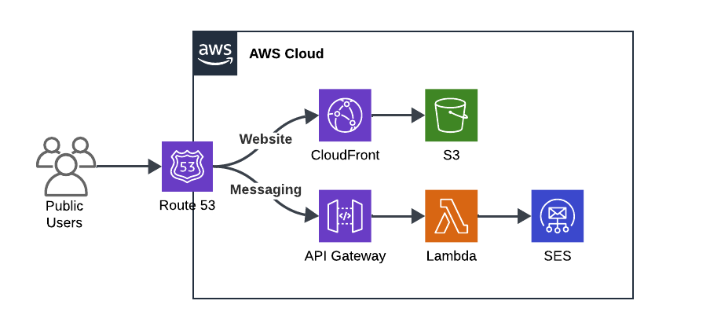

# Portfolio

Portfolio application created by William Callahan

## Frontend

The frontend application is a React application hosted in amazon S3.

## Backend

The backend application handles website message requests through AWS Lambda. From the Lambda, messages are routed to destinations using AWS Simple Email Service (SES).